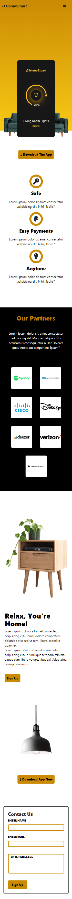
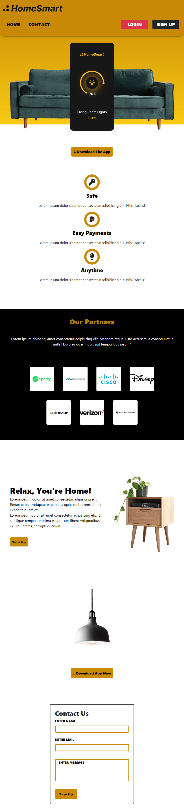
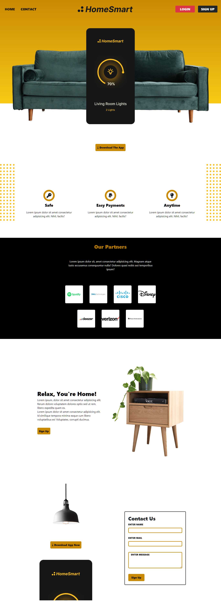

# Furniture Rentals App

This is a challenge by twitter: @codngossy created by me twitter: @jaekralj.

## Approach:

I used bootstrap and SCSS, the navbar is created with bootstrap to reduce work time and aid responsiveness.

The rest of the page was created with mobile first approach in mind and responsiveness across screen sizes was huge part of the thought process that went into this project.

The project was a good one to tackle, I'm open to critical reviews and suggestions.

## Link to Live Site
https://jikkeee.github.io/furniture-rental/

## Full view across devices

